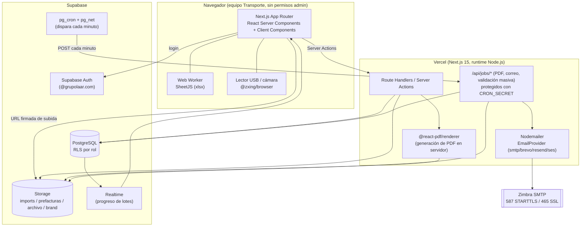
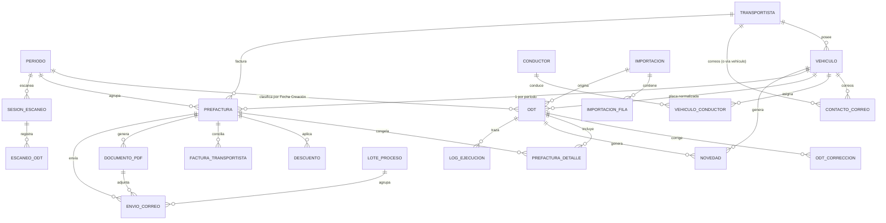
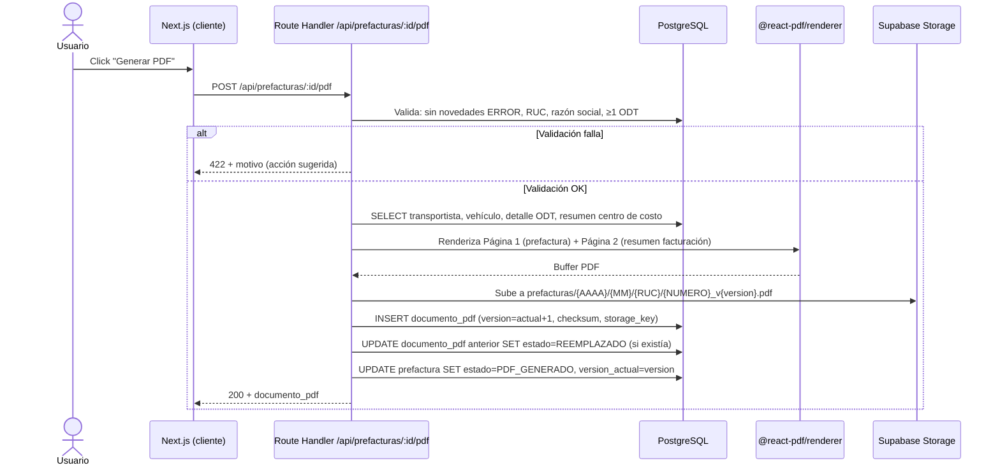

# Arquitectura — Prefacturación de Transporte (LAARCOURIER)

## 1. Visión general

Monorepo simple: una única app **Next.js 15** (App Router) que sirve tanto la
UI como la API (Route Handlers / Server Actions), respaldada por
**Supabase** (PostgreSQL + Auth + Storage) y desplegada en **Vercel**. No hay
backend separado: toda la lógica de negocio vive en el servidor de Next.js
(Server Actions, Route Handlers y jobs `/api/jobs/*`), nunca en el cliente.

### Decisiones técnicas clave

1. **Sin Chromium para PDF.** Se usa `@react-pdf/renderer` (renderiza PDF con
   primitivas propias, no HTML→PDF) porque Vercel no permite instalar
   Chromium de forma confiable en serverless sin capas pesadas (`chrome-aws-lambda`
   agrega ~50 MB y tiempos de cold start altos). Costo: la plantilla se
   escribe con componentes `@react-pdf/renderer` (`<Page>`, `<View>`, `<Text>`),
   no con HTML/CSS libre.
2. **SMTP desde Route Handlers (runtime Node.js), no desde Edge Functions de
   Supabase.** Las Edge Functions de Supabase corren en Deno Deploy, que
   bloquea salientes a puertos 25/587/465. El envío de correo debe ejecutarse
   en un Route Handler de Vercel con `export const runtime = "nodejs"`.
3. **Excel nunca pasa por el body de la API.** El límite de body en Vercel es
   ~4,5 MB y el corte puede pesar varios MB. El navegador sube el archivo
   directo a Supabase Storage con una URL firmada (`createSignedUploadUrl`);
   la API solo recibe el `storage_key` resultante.
4. **Parseo de Excel en Web Worker.** SheetJS (`xlsx`) puede tardar varios
   segundos con 15k+ filas; se ejecuta en un Web Worker (`src/workers/excel-parser.worker.ts`)
   para no bloquear la UI durante la vista previa (pasos "Leer"/"Mapear").
   La validación e inserción real, sin embargo, ocurre en el servidor sobre
   la tabla staging — el worker del navegador solo alimenta la vista previa.
5. **Colas por tabla PostgreSQL con `FOR UPDATE SKIP LOCKED`**, no una cola
   externa (Redis/SQS). Vercel Hobby/Pro no tiene workers persistentes;
   `pg_cron` + `pg_net` disparan un Route Handler cada minuto que hace
   `SELECT ... FOR UPDATE SKIP LOCKED LIMIT N`, procesa el lote y libera.
   Si el usuario tiene la pantalla de envío abierta, el frontend también
   puede invocar el mismo endpoint para procesar más rápido.
6. **Procesamiento masivo por lotes idempotentes.** Las funciones serverless
   de Vercel tienen un límite de tiempo de ejecución; generar PDFs o enviar
   correos para cientos de placas se hace en lotes de tamaño configurable
   (`EMAIL_BATCH_SIZE`), cada lote es una transacción independiente y
   reanudable (estado `PENDIENTE/ENVIANDO/ENVIADO/ERROR` por fila).
7. **RLS como única barrera de autorización de datos.** El cliente de
   Supabase en el navegador usa siempre la `anon key` + sesión del usuario;
   `service_role` solo se usa en Route Handlers protegidos (`CRON_SECRET`) o
   en Server Actions que ya validaron el rol. Nunca se expone `service_role`
   al cliente.
8. **`config/app.config.ts` tipado con Zod, con overrides desde la tabla
   `configuracion`.** Los valores por defecto viven en código (versionados);
   un ADMIN puede sobrescribir en runtime sin desplegar (numeración, ritmo de
   correo, patrones de validación).

## 2. Componentes



## 3. Modelo de datos (entidad-relación simplificado)

El detalle completo de columnas está en las migraciones
(`supabase/migrations/`). Este diagrama muestra las relaciones principales;
se omiten columnas de auditoría (`created_at`, `updated_at`, `created_by`) y
tablas de solo-catálogo por brevedad visual.



> Ver la propuesta completa de columnas y tipos en la sección "MODELO DE
> DATOS" de la especificación original y su implementación literal en
> `supabase/migrations/0001_schema_inicial.sql` y siguientes.

## 4. Flujo de importación

```mermaid
sequenceDiagram
    actor U as Usuario (Transporte)
    participant UI as Next.js (cliente)
    participant W as Web Worker (SheetJS)
    participant ST as Supabase Storage
    participant SA as Server Action
    participant DB as PostgreSQL

    U->>UI: Selecciona archivo (.xlsx/.xls/.xlsb/.csv)
    UI->>SA: Solicita URL firmada de subida
    SA->>ST: createSignedUploadUrl(bucket=imports)
    ST-->>SA: URL firmada (5 min)
    SA-->>UI: URL firmada
    UI->>ST: PUT archivo directo (no pasa por Vercel)
    UI->>W: Lee hojas y vista previa (50 filas)
    W-->>UI: Hojas + encabezados detectados
    U->>UI: Elige hoja y confirma/edita mapeo de columnas
    UI->>SA: Confirmar mapeo (mapeo_columna)
    SA->>DB: INSERT importacion (estado=BORRADOR, hash_sha256)
    Note over SA,DB: Si el hash ya existe, se avisa y se enlaza a la importación previa
    SA->>ST: Descarga archivo (server-side)
    SA->>DB: INSERT importacion_fila (staging, por lote)
    SA->>DB: Ejecuta validaciones (obligatorios, tipos, placa, duplicados, período)
    DB-->>SA: Resumen: válidas / advertencias / errores
    SA-->>UI: Tabla con pestañas Errores/Advertencias/Válidas
    U->>UI: Corrige errores puntuales y revalida (repite validación)
    U->>UI: Confirma importación
    UI->>SA: confirmarImportacion(decisiones por grupo)
    SA->>DB: BEGIN; INSERT odt válidas; INSERT novedad; INSERT log_ejecucion; UPDATE importacion.estado=CONFIRMADA; COMMIT
    DB-->>UI: Importación confirmada (revertible mientras no haya PDF enviado)
```

## 5. Flujo de generación de PDF



## 6. Flujo de envío de correo (individual y masivo)

```mermaid
sequenceDiagram
    actor U as Usuario
    participant UI as Next.js (cliente)
    participant SA as Server Action (encolar)
    participant DB as PostgreSQL
    participant CRON as pg_cron + pg_net
    participant JOB as /api/jobs/email (Node.js runtime)
    participant SMTP as Nodemailer → Zimbra
    participant RT as Supabase Realtime

    U->>UI: "Enviar seleccionados" (N prefacturas)
    UI->>SA: encolarEnvios(prefacturaIds)
    SA->>DB: INSERT lote_proceso; INSERT envio_correo (estado=PENDIENTE) por prefactura
    SA-->>UI: lote_id
    UI->>RT: Suscribe a progreso de lote_proceso
    loop cada minuto
        CRON->>JOB: POST (Authorization: CRON_SECRET)
        JOB->>DB: SELECT envio_correo WHERE estado IN (PENDIENTE,REINTENTAR) FOR UPDATE SKIP LOCKED LIMIT EMAIL_BATCH_SIZE
        JOB->>DB: UPDATE estado=ENVIANDO
        loop por correo (respeta EMAIL_RATE_PER_MINUTE)
            JOB->>SMTP: sendMail(adjunto=PDF vigente)
            alt Éxito
                SMTP-->>JOB: message_id
                JOB->>DB: UPDATE estado=ENVIADO, message_id, enviado_en
            else Error temporal (4xx/timeout)
                JOB->>DB: UPDATE estado=REINTENTAR, intentos+1, proximo_intento=backoff
            else Error permanente (5xx/buzón inexistente)
                JOB->>DB: UPDATE estado=ERROR, error
            end
        end
        JOB->>DB: UPDATE lote_proceso (exitosos, fallidos, estado)
        DB-->>RT: cambios (Realtime)
        RT-->>UI: "145 enviados / 5 con error"
    end
    U->>UI: "Reintentar fallidos" (si aplica)
```

## 7. Almacenamiento (Supabase Storage)

| Bucket        | Contenido                                                      | Acceso                                                                                                           |
| ------------- | -------------------------------------------------------------- | ---------------------------------------------------------------------------------------------------------------- |
| `imports`     | Excel/CSV originales subidos por el usuario                    | Privado, URL firmada 5 min, solo lectura server-side para validar hash/reprocesar                                |
| `prefacturas` | PDFs versionados (`{AAAA}/{MM}/{RUC}/{NUMERO}_v{version}.pdf`) | Privado, URL firmada 5 min para visor/descarga; la fuente de verdad es `documento_pdf`, no el listado de carpeta |
| `archivo`     | Exportes de períodos archivados (`archivo_periodo`)            | Privado, solo ADMIN/CONSULTA con período archivado                                                               |
| `brand`       | Logos y fuentes autoalojadas                                   | Público de solo lectura (assets estáticos de marca)                                                              |

## 8. Seguridad

- RLS activo en todas las tablas; políticas por `perfil_usuario.rol`
  (ADMIN / OPERADOR_TRANSPORTE / CONSULTA) usando `auth.uid()` y una función
  `auth.rol_actual()` que resuelve el rol desde `perfil_usuario`.
- Dominio de correo restringido a `@grupolaar.com` (verificado en Auth hook
  `before_user_created` / trigger, y reforzado en el login de la UI).
- `service_role` solo en Route Handlers/Server Actions server-side; nunca en
  variables `NEXT_PUBLIC_*`.
- Rate limiting en login y en endpoints de importación/envío masivo
  (contador en tabla `configuracion` o middleware con ventana deslizante).
- URLs firmadas de 5 minutos para toda descarga/subida.
- Auditoría (`auditoria`) alimentada por triggers `AFTER INSERT/UPDATE/DELETE`
  en tablas sensibles (`odt`, `prefactura`, `documento_pdf`, `envio_correo`,
  `vehiculo`, `transportista`).

## 9. Pruebas

- **Vitest**: funciones puras de negocio (normalización de placa, parseo de
  fecha, limpieza de texto, mapeo de columnas, cálculo de período,
  correlativo concurrente contra una base de test) y pruebas de integración
  contra un proyecto Supabase local/efímero.
- **Playwright**: flujo E2E completo (login → importar → validar → corregir
  → confirmar → generar prefacturas → PDF → enviar → verificar log), usando
  Mailpit o `smtp-server` como SMTP simulado y `EMAIL_TEST_MODE=true`.
- **Fixtures**: `tests/fixtures/corte-500-filas.xlsx` (muestra anonimizada de
  500 filas reales una vez estén disponibles) + casos borde generados a mano
  (placa vacía, valor 0, fecha fuera de corte, duplicados, ODT en varias
  placas).

## 10. Despliegue

- Vercel conectado a GitHub: preview por PR (con su propia base de datos de
  rama de Supabase o un esquema de pruebas), producción en `main`.
- GitHub Actions: lint + typecheck + test en cada PR; `supabase db push` a
  producción solo desde `main` tras aprobación manual.
- `pg_cron` se configura vía migración SQL (`cron.schedule`) apuntando a
  `pg_net.http_post` hacia `/api/jobs/email` y `/api/jobs/pdf` con el header
  `Authorization: Bearer ${CRON_SECRET}`.
